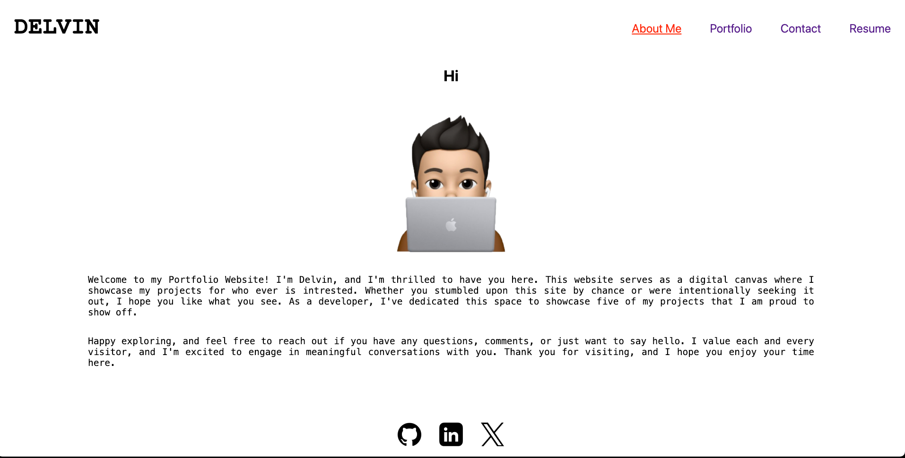
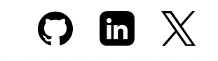
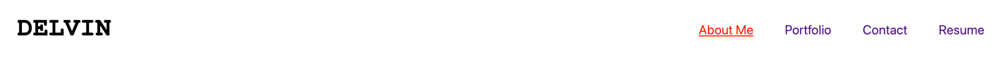
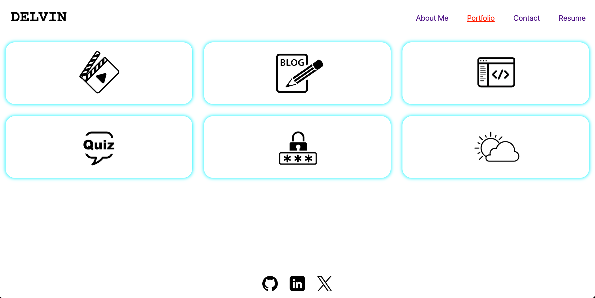
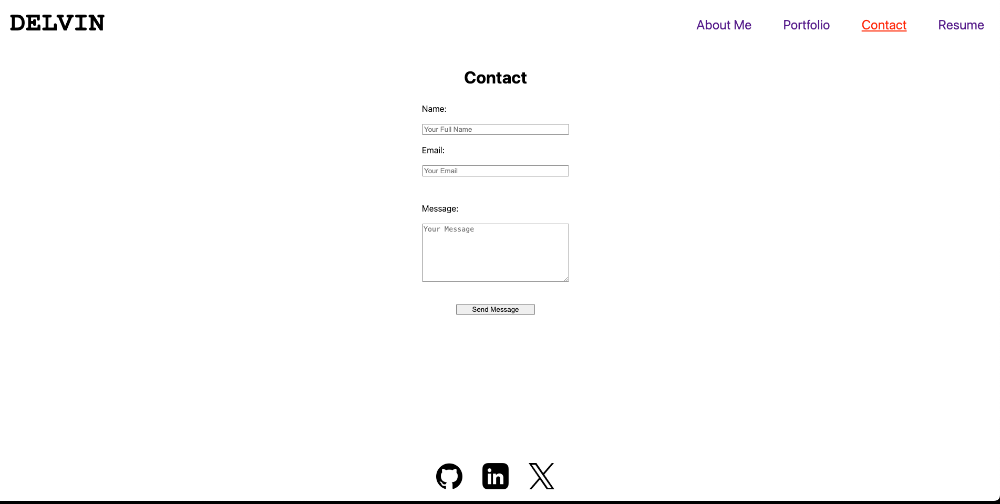
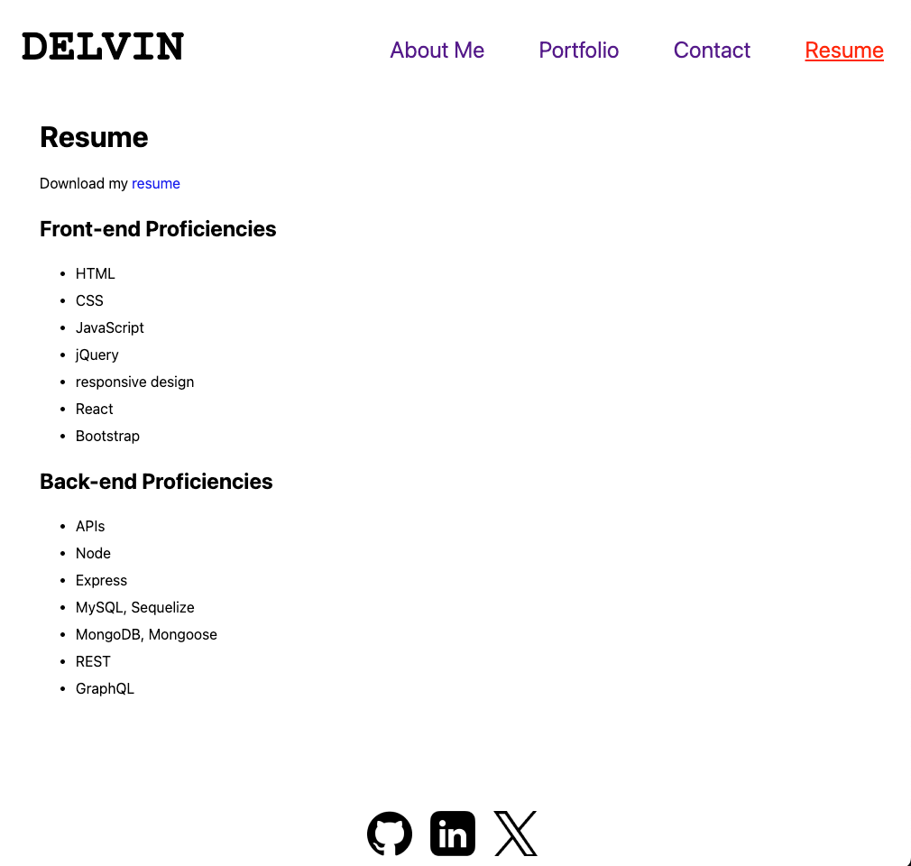

# React Portfolio
 

## Description

My portfolio website created with React.

## Table of Contents

* [Installation](#installation)

* [Usage](#usage)

* [Deployed](#deployed)

* [Credits](#credits)
  
* [License](#license)

* [Contributing](#contributing)

* [Questions](#questions)

## Installation

N/A

## Usage 
Open the link to the website 

[https://my-reactportfolioo.netlify.app/](https://my-reactportfolioo.netlify.app/)

When you open the link you are greeted with a home page as below.

The Homepage is the About page where you can read a little about me the creater of this portfolio. 

You will be abled to see my github, linkedin and X links in the footer as in the pic below:

You can click on these images to open the links corresponding to each of them.

Next you can navigate to any of the following pages Portfolio, Contact or Resume as in the header.

If you navigate to portfolio page you can see my 6 deployed applications with thier deployed link plus github link.

If you navigate to Contact page. You can sent a message to me with you name,email and the message.

Next is the Resume page. In which you can downlod my resume clicking on download my resume and also view my proficiencies in this screen.

## Deployed

[https://my-reactportfolioo.netlify.app/](https://my-reactportfolioo.netlify.app/)

## Credits

N/A

## License

This project is licensed under the MIT license.

## Contributing

Anyone is free to contribute

## Questions

If you have any questions about the repo, open an issue or contact me directly at write2delvin@gmail.com. You can find more of my work at [delve-in](http://github.com/delve-in/).
